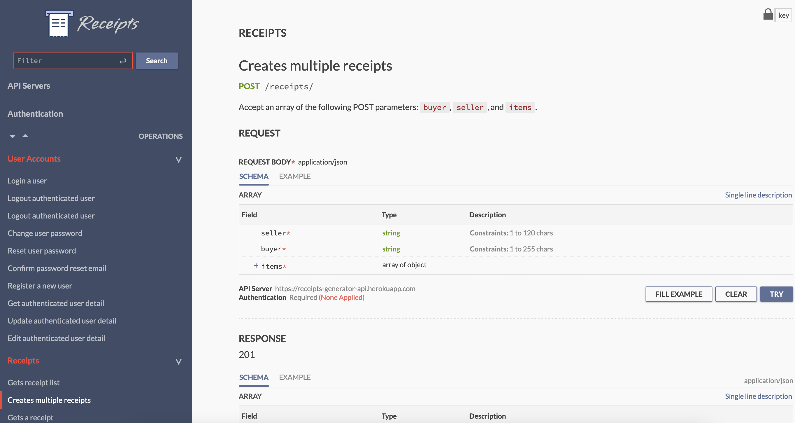

# Aync Receipts



## An Asynchronous Receipts Generator API
A collection of Python/Django RESTful API for generating receipts for authenticated and authorized users.

## Requirements
- Python 3.8
- virtualenv
- Redis

## Packages
- Django 3.1.7
- Django REST Framework 3.12.2
- WeasyPrint
- Gunicorn
- Celery
- Python Decouple
- Django Environ
- boto3
- django-rest-auth
- djang-allauth

## Databases
- SQLite3 (Development)
- PostgreSQL (Production & Staging)

## DevOps Tools
- Docker
- docker-compose

# Deployment Platforms
- Heroku
- AWS S3 (Static and media assets)

## Instruction on how to run the Receipt Generating API locally

### Method 1: Using `Docker` and `docker-compose` (Recommended)
Make sure you have installed the latest docker ecosystem tools (i.e. Docker Engine, Docker CLI, Docker Machine, and docker-compose). After that, follow the following steps:

1. Download or clone this repository to your local machine and change your working directory to the repository directory.
```
$ git clone <repo-url>
$ cd <repo-directory>
```
2. Copy the `.env.example` file to `.env` file. Change the values in the file accordingly.
3. Run the following command:
```
$ docker-compose up --build -d
```

Wait until the container build is complete. Now your endpoints should be available on [http://127.0.0.1:8000/receipts/](http://127.0.0.1:8000/receipts/).


### Method 2: Manual Installation
Make sure you have Python 3.8, virtualenv, and Redis installed.

**MacOS and Linux**
Steps:
1. Download or clone this repository to your local machine and change your working directory to the repository directory.
```
$ git clone <repo-url>
$ cd <repo-directory>
```
2. Copy the `.env.example` file to `.env` file. Change the values in the file accordingly.
3. Create and activate a new python virtual enviroment using the following command:
```
$ virtualenv --python=python3.8 venv
```
4. To install all dependencies and setup your local database, run the following commands
```
(venv)$ pip install -r requirements.txt
(venv)$ python manage.py migrate --no-input
(venv)$ python manage.py runserver 0.0.0.0:8000
```

5. Start your redis server
```
$ sudo service redis-server start
```

6. Start celery workers
```
$ celery -A config worker -l info
```

Now your endpoints should be available on [http://127.0.0.1:8000/receipts/](http://127.0.0.1:8000/receipts/).
